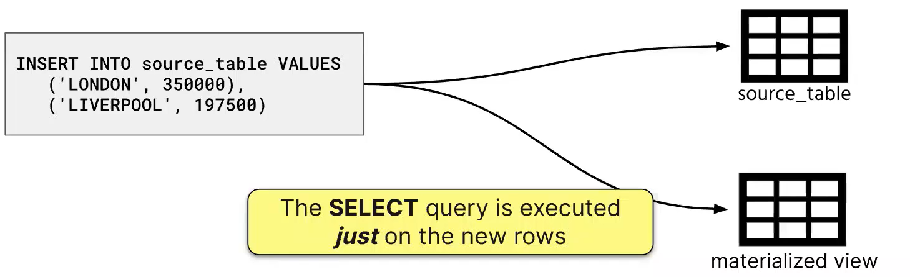

# ClickHouse Studies


## ClickHouse Fundamentals 

<details>
  <summary>1. Introduction</summary>

# Basics

## ClickHouse Install
- ClickHouse - ClickStream + Datawarehouse
- What is OLAP?
- Install ClickHouse
    - [Quick install](https://clickhouse.com/docs/en/install)
    - `curl https://clickhouse.com/ | sh` : Download Clickhouse locally
        - OK for study, testing purpose. Not for prod.
    - `./clickhouse` : Run the following command to start clickhouse-local
    - `clickhouse server`
    - `clickhouse client`
    - `SHOW DATABASES;`

- `sudo clickhouse start` : Start clickhouse-server 
- `clickhouse-client --password` : Start clickhouse-client
 

- ClickHouse Keeper
    - `SHOW DATABASES;`

    - `sudo clickhouse start` : Start clickhouse-server 
    - `clickhouse-client --password` : Start clickhouse-client
- ClickHouse Keeper - TBadded

## [Docker Desktop installation in Windows](https://docs.docker.com/desktop/install/windows-install/)
- Turn Windows features on or off
    - [Hyper-V only for certain windows](https://www.ubackup.com/enterprise-backup/windows-11-hyper-v-not-showing.html#:~:text=Way%201.,-Enable%20Hyper%2DV&text=Launch%20Control%20Panel%2C%20open%20Turn,V%20features%20and%20click%20OK.) such as window 10/11 pro
    - Windows Subsystem for Linux
    - `wsl --version` - to find out the version
    - `wsl --update`
    - `wsl --set-default-version 1/2` - whichever version 1 or 2 you want
    - `docker version` : show both Client and Server versions
    - `docker images` : list images you have got
- Clickhouse images
    - `docker pull clickhouse/clickhouse-client` : clickhouse/clickhouse-client
    - `clickhouse/clickhouse-server image` 
    - `docker pull clickhouse/clickhouse-keeper` : [ClickHouse Keeper](https://hub.docker.com/r/clickhouse/clickhouse-keeper) (clickhouse-keeper), https://clickhouse.com/docs/en/guides/sre/keeper/clickhouse-keeper
    - `docker pull clickhouse/upgrade-check`
- ClickHouse 
    - http://localhost:8123/play
    - clickhouse client uses TCP interface to connect to the server
    - Install Ubunto on VMWareWorkstation pro, https://www.youtube.com/watch?v=luhHDo4ei34&t=3s
    - `sudo docker run hello-world`
    - `sudo docker run -d --name clickhouse-for-course --ulimit nofile=262144:262144 clickhouse/clickhouse-server`
    - `sudo docker container ls` or `docker container ls`
    - `sudo docker exec -it d7 /bin/bash`


</details>

---

## ClickHouse Basic 
<details>
  <summary>Terminologies</summary>

- **[Common Table Expression(CTE)](https://www.atlassian.com/data/sql/using-common-table-expressions)** 
    - It is also known as sub-query factoring or with clause.
    - Example table : employeeID, employeeName, Salary

    ```
        SELECT * FROM employeedb;

        -- Fetch employees who earn more than average salary of all employees 
        -- Option 1
        -- use average_salary as alias 
        -- list column inside the alias. In this case, avg_salary
        with average_salary (avg_salary) as 
           (
            select cast (avg(salary) as int) from emloyeedb
           )
        select * 
        from employeedb edb, average_salary av
        where edb.salary > av.avg_sal;  -- There is no table col with average_salary and you need to create a new query for it. Instead, you could use with clause.
    ```

    ```
        table colums: store_id, store_name, product, quantity, cost
        select * from sales;
        -- MAIN QUERY: Find stores whose sales are better than average sales across all stores
        -- 1. Find total sales per each store - total_sales
            select s.store_id, sum(cost) as total_sales_per_store
            from sales s
            group by s.store_id;
        -- 2. Find average sales with respect to all the stores avg_sales 
        -- We need to reuse the 
        -- 3. Find the stores where total_sales > avg_sales of all stores
    - Another example
        ```
            select
                avg(price)
            from uk_price_paid
            where town = my_town;

            with most_expensive as (
                select * from uk_price_paid
                order by price desc
                limit 10
            )
            select
                avg(price)
            from most_expensive;
        
        ```


    ```
- **Data Types**
    - <ins> Integer types:</ins> signed and unsigned integers (UInt8, UInt16, UInt32, UInt64, UInt128, UInt256, Int8, Int16, Int32, Int64, Int128, Int256)
    - <ins> Floating-point numbers:</ins> floats(Float32 and Float64) and Decimal values
    - <ins> Boolean:</ins> ClickHouse has a Boolean type
    - <ins> Strings:</ins> String and FixedString
    - <ins> Dates:</ins> use Date and Date32 for days, and DateTime and DateTime64 for instances in time
    - <ins> JSON:</ins> the JSON object stores a JSON document in a single column
    - <ins> UUID:</ins> a performant option for storing UUID values
    - <ins> Low cardinality types:</ins> use an Enum when you have a handful of unique values, or use LowCardinality when you have up to 10,000 unique values of a column
    - <ins> Arrays:</ins> any column can be defined as an Array of values
    - <ins> Maps:</ins> use Map for storing key/value pairs
    - <ins> Aggregation function types:</ins> use SimpleAggregateFunction and AggregateFunction for storing the intermediate status of aggregate function results
    - <ins> Nested data structures:</ins> A Nested data structure is like a table inside a cell
    - <ins> Tuples:</ins> A Tuple of elements, each having an individual type.
    - <ins> Nullable:</ins> Nullable allows you to store a value as NULL when a value is "missing" (instead of the column settings its default value for the data type)
    - <ins> IP addresses:</ins> use IPv4 and IPv6 to efficiently store IP addresses
    - <ins> Geo types:</ins> for geographical data, including Point, Ring, Polygon and MultiPolygon
    - <ins> Special data types:</ins> including Expression, Set, Nothing and Interval
- **Datatypes (Interesting)**
    - ***Arrays*** - e.g use function ids Array(UInt32) or use square brackets [ ] 
    - ***[Nullable](https://clickhouse.com/docs/en/sql-reference/data-types/nullable)*** - It is not recommended to use Nullable unless you have to for your use case. 
        - If metric is not Nullable, the value would be 0.
        - To store Nullable type values in a table column, ClickHouse uses a separate file with NULL masks in addition to normal file with values. Mask of 0s and 1s. 
        - Whenever you query, that hidden cols get joined with the actual cols.
        - It has overhead both storage and CPU processing.
        - ***IMPORTANT NOTE:*** Using Nullable almost always negatively affects performance, keep this in mind when designing your databases.
    - ***Enums*** - if you have string cols, you can use Enum.
    - ***[LowCardinality](https://clickhouse.com/docs/en/sql-reference/data-types/lowcardinality)*** - It is highly recommended to use with strings.
        - Useful when you have a column with a relatively small number of unique values
        - Stores values as integers - use dictionary encoding
        - Advantage over Enums:
            - You can dynamically add new values and you don't need to know all the unique values at the time of table creation 

        ```
            CREATE TABLE lc_t
            (
                `id` UInt16,
                `strings` LowCardinality(String)
            )
            ENGINE = MergeTree()
            ORDER BY id
        ```

- **Database**
    - ***Predefined databases***
        - <ins>default</ins> : Initially empty, it will contain tables that are created witout specifying a database
        - <ins>system</ins> : Contains over 60 system tables that maintain all sorts of details and metadata about your clickhouse deployment
        - <ins>INFORMATION_SCHEMA</ins> : Named after an ANSI standard, this database contains metadata about columns, tables, schemas and views (which are alraedy found in the system database)
- **Data Ingestion**
    - To get data in, there are various ways to insert data into clickhouse
    - Ways to ingest data into ClickHouse
        - upload CSV file
        - ClickPipes - currently works for Kafka
            - Kafka is a recommended way.
        - Clickhouse-client and clickhouse-local
        - Messaging service - Kafka, RabbitMQ, SQS, etc.
        - Integration service - Airbute, dbt, Vector, etc.
        - Migrate from another database
        - Client application - Java, Go, Python, etc.
    - Questions to ask when doing data ingestion
        - Where is your data now?
        - What format is your data in? input format to read 
    - Data location
        - Cloud => AWS S3, GCP gcs function, Azure blob - There are table functions for each cloud provider and they provide a table-like interface to files
        - Databases => PostgreSQL, MySQL, MongoDB, SQLite, Any other db ODBC, JDBC => SELECT, INSERT 
        - Open table format => iceberg, hudi, delta lake
        - Services => Kakfa, RabbitMQ, Redis, Hadoop, NATS => Table Engine
- **Data Ingestion Options**
    - local file 
        - `cat yourfile.csv | ./clickhouse client --query="INSERT INTO yourfile.calculate_average FORMAT CSV"`
    - ETL tools - 
    - Kafka, etc.
- **Functions**
    - There are different functions categories:
        - [**regular functions**](https://clickhouse.com/docs/en/sql-reference/functions) -> functions --> they apply to each row separately. Regular functions work as if they are applied to each row separately (for each row, the result of the function does not depend on the other rows)
        - `select lower(town) from uk_price_paid`
        - `select count() from system_functions;`
        - [**aggregate functions**](https://clickhouse.com/docs/en/sql-reference/aggregate-functions) - computation is made based on the values of multiple rows. Aggregate functions accumulate a set of values from various rows (i.e. they depend on the entire set of rows).
            - Aggregate functions work in the normal way as expected by database experts.
            - ClickHouse also supports:
              - Parametric aggregate functions, which accept other parameters in addition to columns.
              - Combinators, which change the behavior of aggregate functions.
            - The list of aggregate functions can be found in this link, https://clickhouse.com/docs/en/sql-reference/aggregate-functions/reference.
            - count, min/max, sum, avg, median, quantile/quantiles - and their variants, any - selects the first encountered value, uniqExact/uniqTheta/uniqHLL12/uniqCombined - (approximate) count of unique values of a column
            - Another groups - statistics
                - varPop/stddevPop/covarPop
                - simpleLinearRegression
                - stochasticLinearRegression/stochasticLogisticRegression
                - corr (the Pearson correlation coefficient)/rankCorr
                - topK/topKWeighted
                - studentTTeset/welchTTest/meanZTest/mannWhitneyUTest, etc (behind the scene, they are C++ functions)

            - `select quantile(0.90)(price) from uk_price_paid`
        - **[Aggregate function combinators](https://clickhouse.com/docs/en/sql-reference/aggregate-functions/combinators)** - Take any aggregate functions and append combinators to it
            - The name of an aggregate function can have a suffix appended to it. This changes the way the aggregate function works.
            - There are so many permutations
            - Other combinators

|Suffix|Description|
|---|---|
|Array|Allows the aggregate function to work with arrays|
|Map|Allows for aggregate function to work with maps|
|SimpleState|Returns a SimpleAggregate Function data type|
|State|Returns an AggregateFunction data type|
|Merge|Merges the intermediate state with the final state of the aggregation|
|MergeState|Similar to Merge, but returns an AggregateFunction type(instead of the result)|
|ForEach|Aggregates over arrays of values|
|OrDefault/OrNull|If there is no input, the default value of the data type is returned(or null)|
|Resample|Lets you divide data into groups and aggregate over the smaller groups|

        - **table functions** --> [for creating table](Table functions are methods for constructing tables.)
        - **[User defined functions](https://clickhouse.com/docs/en/sql-reference/functions/udf)** - Can use SQL based and they are based on lambda expression
            `select arrayMap((x,y) -> lcm(x,y), [7, 10, 15], [9, 100, 120])`
        
        
- **[Granule](https://clickhouse.com/docs/en/engines/table-engines/mergetree-family/mergetree#mergetree-data-storage)** - It is a batch of rows of fixed size which addresses with the primary key. The default value is 8,192 rows per batch. 
    - A granule is the smallest indivisible data set that ClickHouse reads when selecting data. ClickHouse does not split rows or values, so each granule always contains an integer number of rows. The first row of a granule is marked with the value of the primary key for the row.
- **[Input Format](https://clickhouse.com/docs/en/interfaces/formats)** 
    - Clickhouse supports various types of data formats. Popular formats like:
        - Protobuf
        - Avro
        - Parquet
        - Arrow
        - ORC
        - CSV, TSV
        - 20+ formats for JSON data 
- **MergeTree Table** - tbadded
- **Table Engine** : determins
    - How and where the table data is stored
    - Which queries are supported
    - Concurrent data access
    - Whether multithreaded requests are possible
    - How data is replicated.
    - Use ENGINE clause to specify a table engine 
    - ***Table Engine : Popular speical Table Engines*** that provide a unique and useful purpose
        - <ins>Dictionary</ins> - represent dictionary data as a table
        - <ins> View </ins> - implement views ONLY. It only stores SELECT query, no data
        - <ins> Materialized View </ins> - Stores the actual data from a corresponding SELECT query
        - <ins> File </ins> - Useful for exporting table data to a file or converting data from one format to another (csv, TSV, JSON, XML or more)
        - <ins> URL</ins> - Similar to File, but queries data from a remote HTTP/HTTPs server
        - <ins> Memmory </ins> - Stores data only in memory (data is lost on restart), useful for testing
- **[Partition](https://clickhouse.com/docs/en/engines/table-engines/mergetree-family/custom-partitioning-key)**
    - Partitioning is available for the MergeTree family tables, including replicated tables and materialized views.
    - A partition is a logical combination of records in a table by a specified criterion. You can set a partition by an arbitrary criterion, such as by month, by day, or by event type. 
    - Each partition is stored separately to simplify manipulations of this data. When accessing the data, ClickHouse uses the smallest subset of partitions possible
    - Partitions improve performance for queries containing a partitioning key because ClickHouse will filter for that partition before selecting the parts and granules within the partition.
    - **Recommendation :** If you want to improve query performance, focuson defining a good primary key or write a projection or create a materialised view. In most cases, you don't need a partition key. Choose a good clever primary key instead
- **[Primary Key](https://clickhouse.com/docs/en/guides/creating-tables#:~:text=The%20primary%20key%20of%20a,the%20primary%20key%20index%20file.) and Primary Indexes**
    - primary keys in ClickHouse are **not unique** for each row in a table
    - The primary key of a ClickHouse table determines how the data is sorted when written to disk.
    - Every 8,192 rows or 10MB of data (referred to as the index granularity) creates an entry in the primary key index file. This granularity concept creates a sparse index that can easily fit in memory, and the granules represent a stripe of the smallest amount of column data that gets processed during SELECT queries
    - The primary key can be defined using the PRIMARY KEY parameter. If you define a table without a PRIMARY KEY specified, then the key becomes the tuple specified in the ORDER BY clause. If you specify both a PRIMARY KEY and an ORDER BY, the primary key must be a subset of the sort order.
    - All the following Optoin 1, 2 & 3 are the same even though the location of PRIMARY KEY() is different.
    - Syntax Options
        - Option 1 - Defining inside the coloum list

            ```
            CREATE TABLE option1_table
            (
                use_id UInt32,
                message String,
                timestamp DateTime
                metric Decimal(30,2)
                PRIMARY KEY (user_id, timestamp)
            )
            ENGINE = MergeTree
            ```
        - Option 2 - Defining PRIMARY KEY after the TABLE ENGINE

            ```
            CREATE TABLE option2_table
            (
                use_id UInt32,
                message String,
                timestamp DateTime
                metric Decimal(30,2)
            )
            ENGINE = MergeTree
            PRIMARY KEY (user_id, timestamp)
            ```
        - Option 3 - you can have primary key and sort order that are different, but there must be some consistency

            ```
            CREATE TABLE option3_table
            (
                use_id UInt32,
                message String,
                timestamp DateTime
                metric Decimal(30,2)
                PRIMARY KEY(user_id, timestamp)
            )
            ENGINE = MergeTree
            ORDER BY (user_id, timestamp, message)

            ```
    - **Good candidates for primary key columns**
        - lots of queries on a column - if you query a column frequently, adding it to the primary key means its values are indexed and making for faster query performance
        - Order by cardinality in ascedning order, LowCardinality first
    - **Options for creating additional primary indexes**
        - ***Create two tables for the same data*** And the second table with a different primary key 
        - ***Use a projection*** : you can use a single table, but clickhouse creates a hidden table that stores the data sorted in a different day 
        - ***Use a materialized view*** : Stores a data in a separate table based on a SELECT statement, sort the data in the SELECT statement
        - ***Define a skipping index***
    - Further reading
        - [How Clickhouse primary key works and how to choose it](https://medium.com/datadenys/how-clickhouse-primary-key-works-and-how-to-choose-it-4aaf3bf4a8b9)
        - [A Practical Introduction to Primary Indexes in ClickHouse](https://clickhouse.com/docs/en/optimize/sparse-primary-indexes)

- **String functions** - it is part of regular functions
    - **[Manipulating strings](https://clickhouse.com/docs/en/sql-reference/functions/string-functions)** - lower, upper, trim, normalize, encode
    
    - **[Searching strings](https://clickhouse.com/docs/en/sql-reference/functions/string-search-functions)** - Looking for a needle or pattern in a haystack
        - position(haystack, needle[, start_pos])

        ```
        -- How many streets in UK that contains 'King'
        select
            count()
        from uk_price_paid
        where 
            position(street, 'KING') > 0;
        ```
    - Another example

        ```
        select 
            count()
        from uk_price_paid
        where
            multiFuzzyMatchAny(street, 1, ['KING']);
        

        -- Example
            select distinct
                street,
                multiSearchAllPositionsCaseInsensitive(
                    street,
                    ['abbey', 'road']
                ) as positions
            from uk_price_paid
            where not has (positions,0);
        -- Example - want to know the most expensive in town, and which street it is located, https://clickhouse.com/docs/en/sql-reference/aggregate-functions/reference/argmax#:~:text=Calculates%20the%20arg%20value%20for,first%20of%20these%20values%20encountered.
            select
                town,
                max(price),
                -- instead of using subquery, you can use argMax function
                argMax(street, price)
            from uk_price_paid
            group by town;


        ```

    - **[Searching and replacing in strings](https://clickhouse.com/docs/en/sql-reference/functions/string-replace-functions)** - Replacing a needle or pattern in a haystack

- **[Table Function Example](https://clickhouse.com/docs/en/sql-reference/table-functions)**
    - Table functions typically require:
        - URL or path
        - Credentials
        - data format
        - schema
    - Cloud example
    ```
        SELECT timestamp, message
        FROM s3(
            'https://s3.ap-southeast-2.com/data.helloworld{1..3}.csv', --files 1,2,3
            aws_access_key_id,
            aws_secret_access_key,
            'CSV', --data format
            'timestamp UInt64, level String, message String' --data schema inference 
        )
    ```
    - PostgreSQL
        - The database table functions typically require:
            - hostname
            - database name
            - table name
            - credentials
    ```
        SELECT * 
        FROM postgresql(
            'postgre_server:5432', --hostname
            'postgre_database', -- db name
            'postgre_table', -- table name
            'user', --credentials
            'password'
        );
    ```
    - JSON data from Kafka topic
        - Use the Kafka table engine
        - Use clickpipes if you are using clickhouse cloud
    ```
        CREATE TABLE my_table (
            timestamp UInt64,
            level String,
            message String
        )
        ENGINE = Kafka
        SETTINGS    kafka_broker_list = 'localhost:9092',
                    kafka_topic_list = 'my_topic'
                    kafka_group_name = 'group1', 
                    kafka_format = 'JSONEachRow',
                    kafka_num_consumers = '4';
    ```
- **Table functions vs Table Engines**
|Table functions|Table Engines|
|---|---|
|Allow you construct tables from various sources|Some table engine proxy queries to external sources (similar to how the functions work), but looks like a "normal table"|

- Table engines acts as proxies to the external resource, -- behind the scene, it will stream the data from S3. 
    - Streaming data is slow. Therefore, it is not practical to be used in everyday queries. Only for ad-hoc query.
    ```
        CREATE TABLE my_s3_table(
            message String,
            timestamp UInt64
        )
        ENGINE=s3( 
            'https://.../my_bucket/my-file.csv.gz',
            aws_access_key_id,
            aws_secret_access_key,
            'CSV',
            'gzip'
        )
    ```

- **View**
    - **What is view?**
        - The concept of views in ClickHouse is similar to views in other DBMSs.
        - The contents of a view table are based on the results of a SELECT query

    - **What is a materialized view?**
        - A materialized view is a special trigger that stores the result of a SELECT query on data, as it is inserted, into a target table.
        - There are many use cases. One of them is making certain queries work faster.
        - Every materialized view must have a source table.
        - When an INSERT happens to the source table of the SELECT query, the query is executed on newly-inserted rows and the result is inserted into the MV table.
        - 
        - Materialized view never goes back tot he source_table.
        - Read this blog post from clickhouse, [Using Materialized Views in ClickHouse](https://clickhouse.com/blog/using-materialized-views-in-clickhouse)
        - [Create views](https://clickhouse.com/docs/en/sql-reference/statements/create/view#materialized-view)

    - **DO and DON'ts about Materialized View**
        - Avoid using POPULATE, it creates a table behind the scene and the table name is random
            - clickhouse implicityly create inner.{uuid}
        - Use TO clause and Create your own MV table 
    - **3 step process to define MV**
        - Define the destination table
        - Define the Materialized View using TO clause, not POPULATE - "to" the destination table
        - Populate the destination table with historic data 

        ```
            -- STEP ONE - CREATE THE DESTINATION TABLE
            -- ========================================
            create table uk_price_by_town_dest (
                price UInt32,
                date Date,
                street LowCardinality(String),
                town LowCardinality(String),
                district LowCardinality(String)
            )
            engine = MergeTree
            order by town;

            -- STEP TWO : DEFINE THE MATERIALIZED VIEW USING TO CLAUSE
            -- =======================================================
            create materialized view uk_price_by_town_view_dest
            to uk_price_by_town_dest
            as select
                price,
                date,
                street,
                town, 
                district
                from uk_price_paid
                where date >= toDate('2024-02-14');
            
            -- STEP THREE : - Populate the destination table with historic data 
            --=================================================================
            insert into uk_price_by_town_dest
                select
                price,
                date,
                street,
                town, 
                district
                from uk_price_paid
                where date <= toDate('2024-02-14');
            
            -- STEP FOUR : Verify
            --======================================
        ```
        - References:
            - [ClickHouse materialized view](https://medium.com/@dengqs402/clickhouse-materialized-view-4e7298a24c93)
    - **When to use a normal view?**
        - The results of the view change often - which are not great candidates for materialized views
        - The results of the view are not used very often - relative to the rate at which the result change
        - the query is NOT RESOURCE INTENSIVE, it is not expensive to run the query over and over again.
        - NOTE : If your use case does not fit these above limited scenarios, consider defining a materialized view

## SQL and other fundamentals concepts for ClickHouse

- Cardinality
- Multithreading and Multithreaded request
- Namespace
- Partitioning
- Primary Key 
- UnsignedInt vs SignedInt
- View

- Sparse Index
A sparse index is a type of database index in which index entries are not created for every single row in the table but rather at intervals. This makes the index file smaller and requires less memory, as only selected rows have corresponding index entries. In the context of ClickHouse (or similar databases), this means not every row is directly indexed, but rather chunks or blocks of rows are indexed.

- Example: Imagine you have a book where, instead of listing every page number in the table of contents, you only list the page number at the start of each new chapter. If you're looking for something in Chapter 3, you don’t need to know the page number of every single page in that chapter; you just need to know where Chapter 3 starts and you can flip through the chapter to find what you need. Similarly, in a database with a sparse index, if you're looking for a specific row, the database knows which block of rows (granule) to access based on the sparse index and can then scan within that block to find the exact row.

- Index Granularity
Index granularity refers to the size or number of rows that make up each block or segment that is indexed in a sparse index system. It determines how much data is covered by each entry in the index. A smaller granularity means more entries in the index, leading to a potentially larger index but finer control over the data blocks accessed during queries. Conversely, a larger granularity reduces the size of the index but may increase the amount of data scanned during a query.

- Example: Continuing with the book analogy, consider granularity as the number of pages per chapter. If each chapter (granule) is about 10 pages long, then your table of contents (sparse index) helps you jump directly to the start of the chapter containing the page you're interested in. In the context of the ClickHouse table you mentioned, every 8,192 rows form a granule. When a query is executed, ClickHouse uses the sparse index to quickly locate the granule containing the target rows and only scans those rows, rather than the entire dataset.
 - In summary, the sparse index and index granularity work together to efficiently locate and process data within large datasets by minimizing memory usage and reducing the amount of data scanned during queries. This is particularly beneficial in systems like ClickHouse that handle very large volumes of data.
</details>

### Other Useful resources
- SQL tutorial, http://www.sql-tutorial.com/


